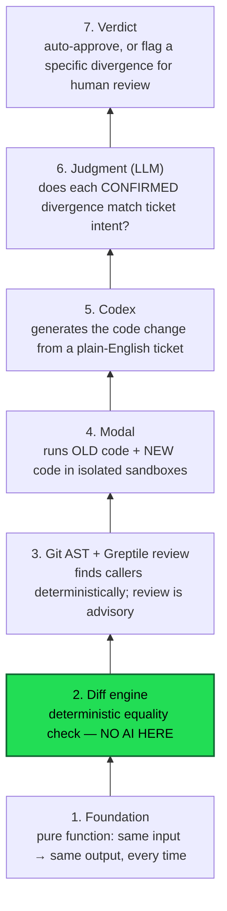
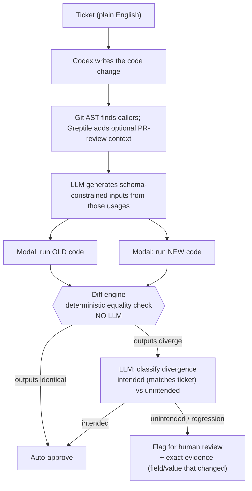
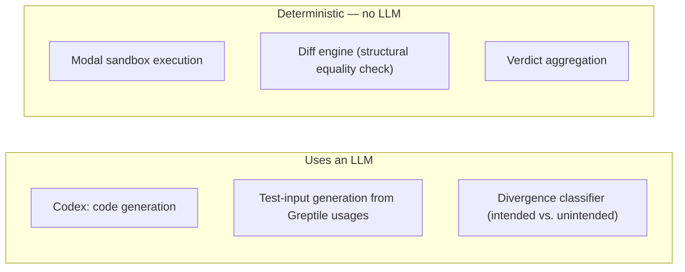

# Alibi — Architecture

## Pipeline layers

Each layer is built on top of the one below it. Layer 2 (the diff engine) is the load-bearing claim of the whole project: it is plain code, never an LLM call.

## End-to-end data flow

## Where AI is used vs. where it isn't

**Core rule:** the diff engine never calls an LLM. It's the same operation any test assertion uses — `assert old_output == new_output` — structured to report the exact field/value that changed. AI touches code generation, test-input generation, and judgment on *already-confirmed* diffs. It never touches the comparison itself.

## Scope boundary (hackathon)

Stay inside pure functions only:
- same input → same output, always
- no DB calls, no timestamps, no randomness, no network calls
- no change to the function's signature (same params in, before and after)

This is the only zone where every layer above is unambiguously true with zero caveats.

## Tech stack per layer

| Layer | Tool | Role |
|---|---|---|
| Code generation | OpenAI Codex | Writes the fix from the ticket |
| Usage discovery | Git + Python AST | Finds executable call sites deterministically |
| PR review context | Greptile | Adds optional advisory review comments from GitHub |
| Sandboxed execution | Modal | Runs OLD and NEW code in isolation, returns outputs |
| Diff engine | Plain Python/TypeScript | Deterministic structural equality check |
| Test input generation | LLM (Claude or GPT) | Turns real usage patterns into concrete test inputs |
| Divergence classifier | LLM (Claude or GPT) | Judges whether a CONFIRMED output change matches ticket intent |
| Memory (stretch) | Claude-Mem | Speeds up repeat verifications on similar code — build last |
